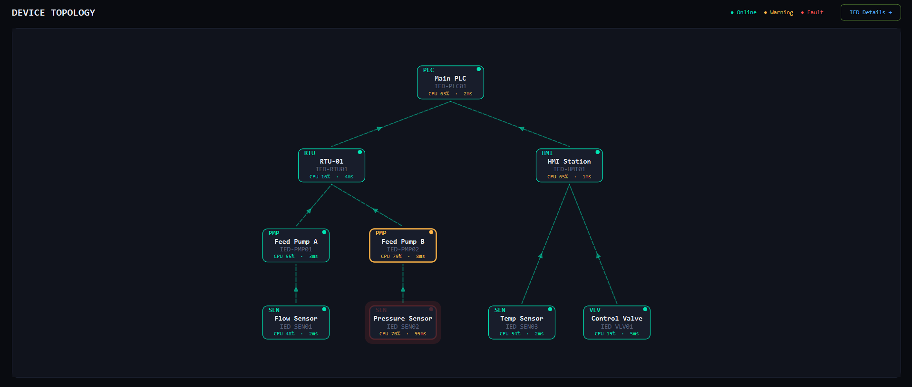
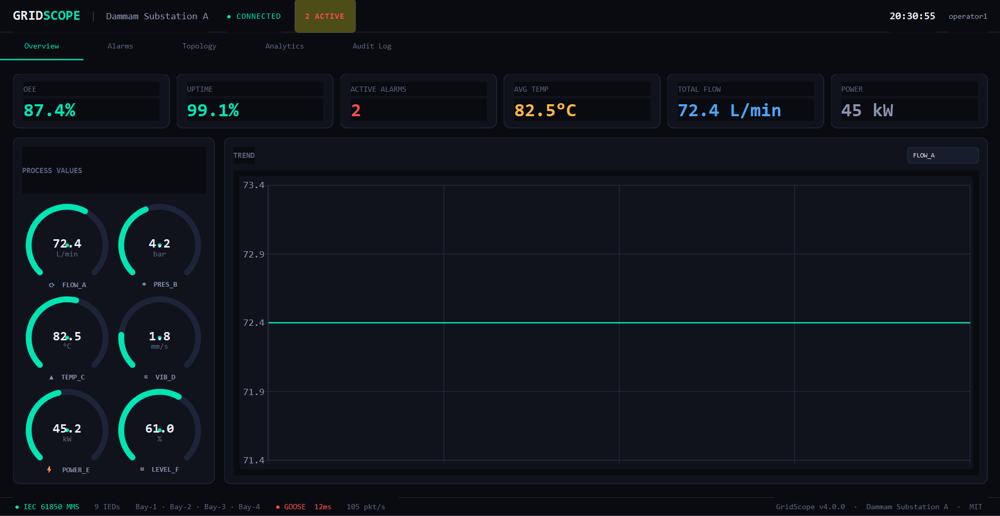
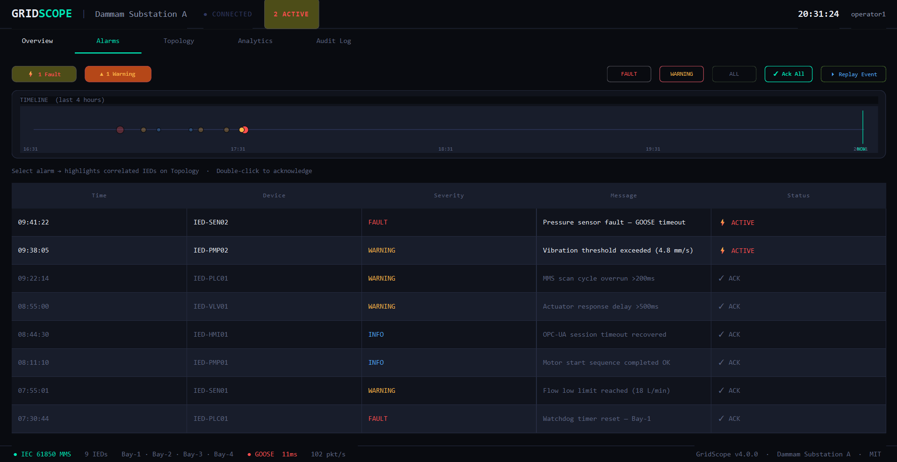

# GridScope — Modern SCADA Dashboard

A modern SCADA desktop application built with Python + PyQt6.

## Overview







## Features

| Module | Description |
|---|---|
| **Overview** | Live KPI cards, process gauges, real-time trend chart, tag monitor |
| **Alarms** | Alarm timeline, severity filtering, one-click acknowledge |
| **Topology** | Interactive device topology graph (drag nodes) |
| **Analytics** | 4-panel trend charts, system health diagnostics |
| **Audit Log** | Full user action log with search and CSV export |
| **Dark / Light Mode** | One-click theme toggle |

## Installation

```bash
pip install PyQt6 PyQt6-Charts
python main.py
```

## Requirements

- Python 3.10+
- PyQt6 >= 6.5
- PyQt6-Charts >= 6.5

## Project Structure

```
nexscada/
├── main.py          # Full application (single file for now)
├── requirements.txt
└── README.md
```

## Roadmap

- [ ] OPC-UA / Modbus real device connection
- [ ] PostgreSQL historian backend
- [ ] User authentication & roles
- [ ] Demo website (GridScope.io)
- [ ] Plugin system for custom widgets
- [ ] Report generation (PDF export)

## License

MIT — free to use, modify, and deploy.
